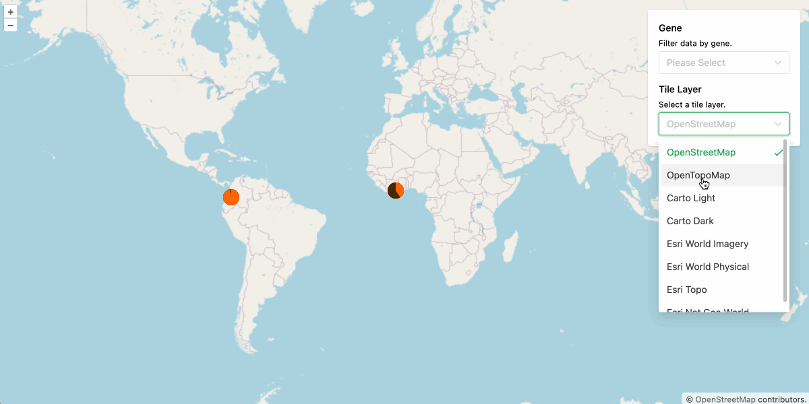

# Allele Frequency Map Visualization

Displays how often a genetic variant (allele) occurs across different geographic regions or populations, revealing spatial patterns of genetic diversity. By mapping frequencies, scientists can identify signals of natural selection, population structure, or migration. For example, such a map could be applied in studying how resistance alleles for a bacterial/viral/fungal contagion spread across a geographic population, helping researchers understand evolutionary pressures which guide public health, agricultural, and economic interventions.

Designed for use inside of [Galaxy Project](https://github.com/galaxyproject/galaxy/issues) (via [Galaxy-Charts](https://github.com/galaxyproject/galaxy-charts/tree/main/src) framework).

## Feature Set

### Utilizes existing infrasctructure dependency (OpenLayers)

- Refers to third-party [map] baselayer library with full citations (OL)
- Restricts baselayer options to public-use, non-rate limited (XML)
- Templatizes baselayer drop-down into Settings sidebar (Galaxy-Charts)
- Preloads all map tiles upon init; user only shows/hides maps (Vue)
- Adds map markers with tooltips from user dataset (Galaxy, MapViewer)

### Extends existing framework for custom functionality (Galaxy-Charts)

- Adds custom floating auto-complete drop-down field (Vue)
- Componentizes select field for better code separation (Vue)
- Populates select field options from user dataset (Galaxy)
- Allows user to filter map markers by Gene Name (OL, JS)

Designed for [#472](https://github.com/galaxyproject/brc-analytics/issues/472)
